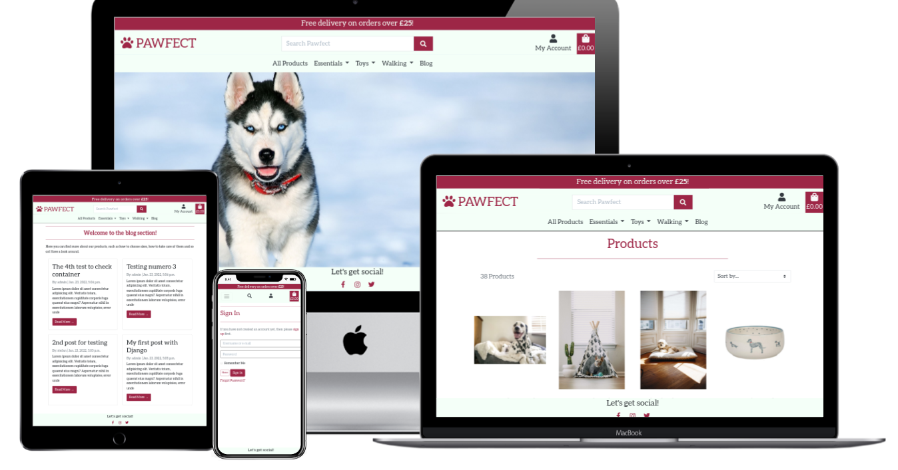
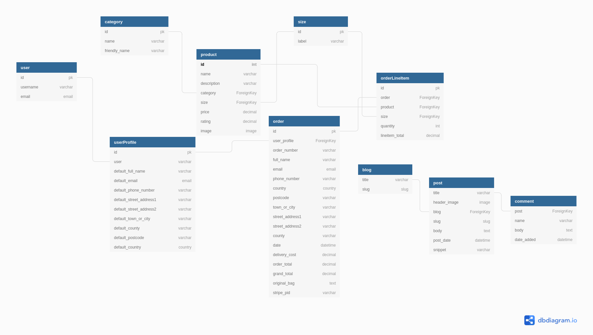

# Pawfect!

*Accessories for everybody's best friend*

**[Live demo](https://pawfect.onrender.com/)**

---
[**Index**](#up)  
[**1. Overview**](#1-overview)  
[**2. UX**](#2-ux)  
- [2.1 User Stories](#21-user-stories)  
- [2.2 Wireframes](#22-wireframes) 
- [2.3 Database schema](#23-database-schema) 
- [2.4 Design](#24-design) 

[**3. Features**](#3-features) 
- [3.1 Existing features](#31-existing-features)  
- [3.2 Features to add](#32-features-to-add)  

[**4. Technologies used**](#4-technologies-used)  
[**5. Testing**](#5-testing)  
[**6. Deployment**](#6-deployment)  
[**7. Credits**](#7-credits)  

# 1. Overview
Pawfect, just as the name sugests, aims at providing quality affordable accesories that perfectly suits your four-legged mud-lover family members. With a range of choices from essentials to toys, you will find something that the king/queen of the house will enjoy.

## What's on offer?
Browse the *Essentials* where you can find beds, bowls and grooming kits. If your pouch needs *Toys* then you can choose from plush, throwing, chewing or squeaky! And don't forget the absolutely most important ones: *Walking* accesories, with a choice of collars, leads, harnesses and safety.
# 2. UX  
The user should find the application easy to navigate, intuitive and responsive, whilst providing consistency and security for payment details.
## 2.1 User Stories 
| User Story ID | As a...         | I want to be able to...                    | In order to...                                           |
|---------------|-----------------|--------------------------------------------|----------------------------------------------------------|
| 1             | Website visitor | Understand what it's got to offer          | Decide if it's worth browsing                            |
| 2             |                 | Find a list of products                    | Make a purchase                                          |
| 3             |                 | Filter the list of products                | Reduce the time of browsing                              |
| 4             |                 | Search the list of products                | Quickly find what I am interested in                     |
| 5             |                 | See details about a product                | Check the price, description, rating and available sizes |
| 6             |                 | See the total of my shopping bag           | Keep track of my spending                                |
| 7             |                 | Purchase products without being registered | Avoid this step at the moment                            |
| 8             |                 | Receive email confirming my order details  | Make sure the Order was placed successfully              |
| 9             |                 | Browse the blog for relevant information   | Learn about specific queries                             |
| 10            |                 | Easily Register for an account             | View my profile                                          |
| 11            | Registered user | Easily Log In/Out                          | Access my account info                                   |
| 12            |                 | Easily recover forgotten password          | Regain access to my account                              |
| 13            |                 | Save my default delivery details           | Checkout faster                                          |
| 14            |                 | View my purchase history                   | Keep track of my shopping                                |
| 15            | Business owner  | View, add, update and delete products      | Show an updated list of products to customers            |
| 16            |                 | Write blog posts about products            | Inform customers about products and dogs wellbeing       |

## 2.2 Wireframes
Full width wireframes for mobile, tablet and desktop can be accessed **[here](wireframes)**.

## 2.3 Database schema
Giving the relations between tables the project uses a relational database, with SWLite being used in development and Postgress in production. The relation between tables can be observed in the diagram below:

The database model is focused on the following models:  
**Product**  
This model is the core model and it's main attributes are name, description, category, sizes if available and price. The model has a ForeignKey to Category in order to group products together.  
**Category**  
This model is used to group products by category and has just a name attribute.  
**Order**  
This model stores information about the order being created, such us order number for future reference and delivery details along the total cost. It will also store a user's profile.  
**OrderLineItem**  
By accessing the Product and Order models it stores info about each product line within an order.  
**UserProfile**  
The model is used to save information about users in order to speed up the checkout process. It also displays the order history.  
**Post**  
This model helps admin to create Blog posts and holds as attributes a name, a slug that helps create individual urls, the author, the body where the actual content will go and information about the date is was posted/updated.  
**Comment**  
Holds information about the user along with the text content and requires the admin to approve the comments in order to prevent spam. It also has a ForeignKey to Post so that the comment gets attached to the relevant Blog post.  
## 2.4 Design
**Color scheme**  
The project uses the following colors:
-  #9d2646 (ruby)  
and
-  #f4fff8 (mint green)  

The main color is ruby and can be found across the website on either the background of the elements or as a font color for header elements. 
The mint green is only used as a background color for header and footer and helps to make the transition from those elements to the page content.  
**Font**  
The project uses *Aleo* throughout the website for consistency.  
**Buttons**  
A variation between background and border has been used using the Ruby color in order to highlight various actions.  
**Icons**  
Icons used bear the colour of the elements they precede or they use the same Ruby colour.  
**Shadow**  
To highlight each individual product, the card element has a shadow effect which makes them stand out and also border the elements with a white backround.  

# 3. Features 
## 3.1 Existing features
Across the website:  
**Responsive**  
The website displays well across all devices thanks to Bootstrap's grid system.  
**Custom Navbar**  
Navbar provides user with quick access to key pages. On mobile view there's a navbar toggler along with the search and user icons and the shopping bag. On large screens the navbar menu is displayed with dropdown for various categories.  
**Search bar**  
Provides quick access to the database and makes queries to the product name and description.  
**Toasts**  
Provides feedback for user action, such as adding products to the bag or updating it.  
**Home Page**  
Home page has a call to action button and displays a hero image.  
**Products Page**  
Displays all the products and has the following features:
- **Sorting** the products based on price, rating, name and category
- **Displaying** the essential info about a product (Name, price, category and rating)
- **Edit/Delete** option for admin  

**Product Detail Page**  
- **Displays** details about a product and includes a descprition along with the details presented on Products page
- **Quantity** input form for user to select the desired quantity
- **Size** selector for products that have sizes
- **Edit/Delete** option for admin  

**Shopping bag**  
- **Displays** individual lines for each product with essential info (image, name, size if any, price and subtotal)
- **Quantity** input form for user to update product quantity
- **Delete** button if user wants to remove an item
- **Price** info displaying the total, delivery costs and Grand total  

**Checkout**  
- **Form** to fill in for delivery details
- **Displays** order summary
- **Payment** handled by Stripe
- **Form prefill** for registered users
- **Save details** option for future deliveries  

**Checkout success**  
- **Confirmation** of the order being received with Order info, Delivery and contact details being displayed along with the Total.  

**Profile**
- **Registered** users can update their delivery information and see their order history
- **Admin** can perform add/edit operations on products  

**CRUD functionality**  
- **Create**: all users can create a comment on blog posts; Admin only can create new products and Blog posts
- **Read**: all users can see details about products and read blog articles
- **Update**: reserved to registered users, they can update their profile info. On top of that, admin can update products and Blog posts
- **Delete**: Admin can delete products, Blog posts and comments.

**Access protection**  
```@login_required``` decorator was used to ensure non-super-users cannot interfere with the database.  
**Static and image file hosting**  
Project uses Amazon S3 bucket to store static files and images.  
**404 and 500 error handling** to keep user on website and minimize disruption.

## 3.2 Features to add
- Functionality to add a product to a **wish list**
- Suggestions regarding **related products**

# 4. Technologies used
**Languages**
- [CSS](https://developer.mozilla.org/en-US/docs/Web/CSS)
- [HTML](https://developer.mozilla.org/en-US/docs/Web/HTML)
- [Javascript](https://developer.mozilla.org/en-US/docs/Web/JavaScript)
- [Python](https://www.python.org/)

**Frameworks**
- [Bootstrap](https://getbootstrap.com/)
- [Django](https://www.djangoproject.com/)
- [jQuery](https://jquery.com/)

**Database**
- [Heroku Postgres](https://www.heroku.com/postgres)

**Extensions**
- [Stripe](https://stripe.com/docs)
- [Boto3](https://boto3.amazonaws.com/v1/documentation/api/latest/index.html)
- [Pillow](https://pillow.readthedocs.io/en/stable/)

**Project Management**
- [Balsamiq](https://balsamiq.com/wireframes/)
- [GitPod](https://gitpod.io/workspaces)
- [GitHub](https://github.com/)
- [Amazon AWS](https://aws.amazon.com/) (S3)

**Tools**
- [DB Diagram](https://dbdiagram.io/home)
- [Favicon.io](https://favicon.io//)  
- [Panda image compression](https://tinypng.com/)
- [Font Awesome](https://fontawesome.com/)
- [Google Fonts](https://fonts.google.com/)
- [Mockup generator](http://techsini.com/multi-mockup/index.php)

# 5. Testing 
Details about this section can be found [here](TESTING.md).

# 6. Deployment
**Prerequisites**  
[Python 3](https://www.python.org/downloads/)  
[PIP](https://pypi.org/project/pip/) - package installation  
[GIT](https://git-scm.com/) version control  
[Amazon AWS S3 Bucket](https://aws.amazon.com/) for hosting static and media files  

<details>
<summary>How to clone Pawfect and run locally</summary>
<p>

To clone this project from its [GitHub repository](https://github.com/StefanMdvs/pawfect):
1. From the repository, click **Code**
2. In the **Clone >> HTTPS** section, copy the clone URL for the repository
3. In your local IDE open Git Bash
4. Change the current working directory to the location where you want the cloned directory to be made
5. Type `git clone`, and then paste the URL you copied in Step 2
```console
git clone git@github.com:StefanMdvs/pawfect.git
```
6. Press Enter. Your local clone will be created
7. Create a file called `env.py` to hold your app's environment variables, which should contain the following:

```console
import os

os.environ.setdefault("SECRET_KEY", "<app secret key of your choice>")
os.environ.setdefault("DEVELOPMENT", "True")
os.environ.setdefault('STRIPE_PUBLIC_KEY', '<key generated by Stripe>')
os.environ.setdefault('STRIPE_SECRET_KEY', '<key generated by Stripe>')
os.environ.setdefault('STRIPE_WH_SECRET', '<key generated by Stripe for individual webhook endpoint>')
```
To find your Stripe keys, login to Stripe and then under the **Developers** tab look for the 'Publishable Key' and 'Secret Key'

The webhook secret key can be found under **Webhooks** once you have created an endpoint, which should be set to receive all events and match this url structure:
```
<your site's base url>/checkout/wh/
```
You will need a different endpoint for the local version and deployed site, updating the `STRIPE_WH_SECRET` accordingly in their respective environment variables.

8. **Make sure the following are listed in your .gitignore file to prevent any environment variables being pushed publicly:**
```
core.Microsoft*
core.mongo*
core.python*
env.py
__pycache__/
*.py[cod]
*.sqlite3
*.pyc
node_modules/
db.json
```
9. Install the app requirements using:
```
pip3 install requirements.txt
```
10. Apply database migrations using:
```
python manage.py migrate
```
11. Create a new superuser and fill in your details:
```
python manage.py createsuperuser
```
12. The app can now be run locally using
```
python manage.py runserver
```
</details>

<p>

<details>
<summary>How to deploy to Heroku</summary>
<p>

To deploy the app to Heroku from its [GitHub repository](https://github.com/StefanMdvs/pawfect), the following steps were taken:
1. **Log In** to [Heroku](https://id.heroku.com/login)
2. Select **Create new app** from the dropdown in the Heroku dashboard
3. Choose a unique name for the app and the location nearest to you
4. Under **Resources** search for and add **Heroku Postgres** to your app
5. In your CLI install **dj_database_url** and **psycopg2** so that you can use Postgres on your deployed site
```
pip3 install dj_database_url
pip3 install psycopg2
```
7. Log into Heroku via the CLI
```
heroku login -i
```
8. Migrate the database into Postgres
```
heroku run python manage.py migrate
```
9. Create a new superuser and fill in your details:
```
python manage.py createsuperuser
```
10. Install gunicorn
```
pip3 install gunicorn
```
11. Freeze the app's requirements
```
pip3 freeze > requirements.txt
```
11. Create a file called **Procfile** and include the following, making sure not to leave a blank line after it:
```
web: gunicorn pawfect.wsgi:application
```
12. Disable Heroku's static file collection (temporarily)
```
heroku config:set DISABLE_COLLECTSTATIC=1 --app pawfect-sm
```
13. Add the hostname of your Heroku app to settings.py
```
ALLOWED_HOSTS = ['pawfect-sm.herokuapp.com', 'localhost']
```
14. Back in Heroku, select the **Deploy** tab and under **Deployment method** choose GitHub
15. In **Connect to GitHub** enter your GitHub repository details and once found, click **Connect**
16. Go to the **Settings** tab and under **Config Vars** choose **Reveal Config Vars**
17. Enter the following keys and values, some of which will be different from those in your env.py:

|**Key**|**Value**|
|:-----|:-----|
|AWS_ACCESS_KEY_ID|`<your variable here>`|
|AWS_SECRET_ACCESS_KEY|`<your variable here>`|
|DATABASE_URL|`<added by Heroku when Postgres installed>`|
|DISABLE_COLLECTSTATIC|`1` NB this variable will be deleted later|
|EMAIL_HOST_PASS|`<your variable here>`|
|EMAIL_HOST_USER|`<your variable here>`|
|SECRET_KEY|`<your variable here>`|
|STRIPE_PUBLIC_KEY|`<your variable here>`|
|STRIPE_SECRET_KEY|`<your variable here>`|
|STRIPE_WH_SECRET|`<different from env.py>`|
|USE_AWS|True|

18. Go back to the **Deploy** tab and under **Automatic deploys** choose **Enable Automatic Deploys**
19. Back in your GitPod CLI add, commit and push your changes and Heroku will automatically deploy your app
```
git add .
git commit -m "Initial commit"
git push
```
20. Your deployed site can be launched by clicking **Open App** from its page within Heroku.

</details>

<p>

<details>
<summary>Setting up an S3 Bucket</summary>
<p>

1. Create an [Amazon AWS](aws.amazon.com) account
2. Search for **S3** and create a new bucket
- Allow public access
- Acknowledge
3. Under **Properties > Static** website hosting
- Enable
- Index.html as index document
- Save
4. Under **Permissions > CORS** use:
```
		[
  {
      "AllowedHeaders": [
          "Authorization"
      ],
      "AllowedMethods": [
          "GET"
      ],
      "AllowedOrigins": [
          "*"
      ],
      "ExposeHeaders": []
  }
]
```
5. Under **Permissions > Bucket Policy**:
- Generate Bucket Policy and take note of **Bucket ARN**
- Chose **S3 Bucket Policy** as Type of Policy
- For **Principal**, enter `*`
- Enter **ARN** noted above
- **Add Statement**
- **Generate Policy**
- Copy **Policy JSON Document**
- Paste policy into **Edit Bucket policy** on the previous tab
- Save changes

6. Under **Access Control List (ACL)**:
- For **Everyone (public access)**, tick **List**
- Accept that everyone in the world may access the Bucket
- Save changes

</details>
<p>
<details>
<summary>Setting up AWS IAM (Identity and Access Management)</summary>
<p>

1. From the **IAM dashboard** within AWS, select **User Groups**:
- Create new group e.g. `manage-pawfect-sm`
- Click through without adding a policy
- **Create Group**
2. Select **Policies**:
- Create policy
- Under **JSON** tab, click **Import managed policy**
- Choose **AmazongS3FullAccess**
- Edit the resource to include the **Bucket ARN** noted earlier when creating the Bucket Policy:
```
			"Resource": [
			                "arn:aws:s3:::pawfect-sm",
			                "arn:aws:s3:::pawfect-sm/*"
            ]
```
- Click **next step** and go to **Review policy**
- Give the policy a name e.g. `pawfect-sm-policy` and description
- **Create policy**
3. Go back to **User Groups** and choose the group created earlier
- Under **Permissions > Add permissions**, choose **Attach Policies** and select the one just created
- **Add permissions**
4. Under **Users**:
- Choose a user name e.g. `pawfect-sm-staticfiles-user`
- Select **Programmatic access** as the **Access type**
- Click Next
- Add the user to the Group just created
- Click Next and **Create User**
5. **Download the `.csv` containing the access key and secret access key. This will NOT be available to download again**

</details>
<p>
<details>
<summary>Connect Django to S3</summary>
<p>

1. Install boto3 and django-storages
```
pip3 install boto3
pip3 install django-storages
pip3 freeze > requirements.txt
```
2. Add the values from the `.csv` you downloaded to your Heroku Cvars under Settings:
```
AWS_ACCESS_KEY_ID
AWS_SECRET_ACCESS_KEY
```
3. Delete the `DISABLE_COLLECTSTATIC` variable from your Cvars and deploy your Heroku app
4. With your S3 bucket now set up, you can create a new folder called `media` (at the same level as the newly added `static` folder) and upload any required media files to it, making sure they are publicly accessible under **Permissions**

</details>  


# 7. Credits  

**Tutorials/Resources**
- [Build a Blog with django](https://djangocentral.com/building-a-blog-application-with-django/)  and
- [Codemy.com youtube channel](https://www.youtube.com/watch?v=B40bteAMM_M&list=PLCC34OHNcOtr025c1kHSPrnP18YPB-NFi&ab_channel=Codemy.com)

**Student projects**
- [Edb83's Project](https://github.com/Edb83/moose-juice), especially for the Deployment section

**Content**
- Hero image from [Pixabay](https://pixabay.com/photos/dog-husky-friend-2332240/)
- Product pictures from [Lords&Labradors website](https://www.lordsandlabradors.co.uk/)

**Acknowledgements**
- My mentor for being supportive and always making time to help
- Jo from Tutor support that helped me out when I was stuck
- My friend Marcel for his availability and support

**Disclaimer**  
This project was developed for educational purposes only.
