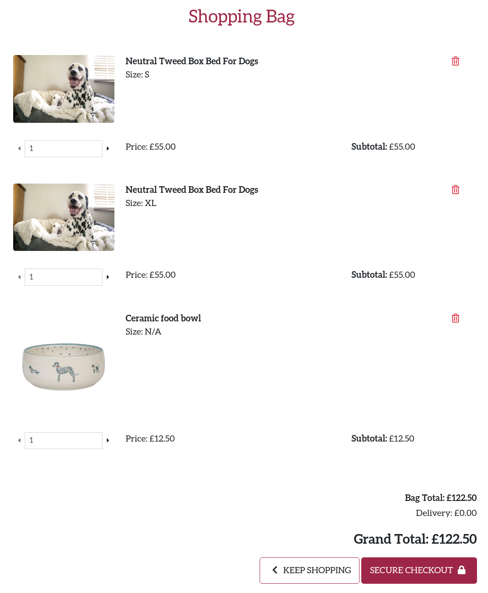
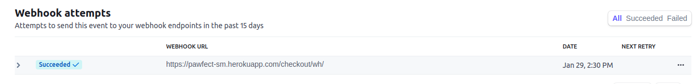
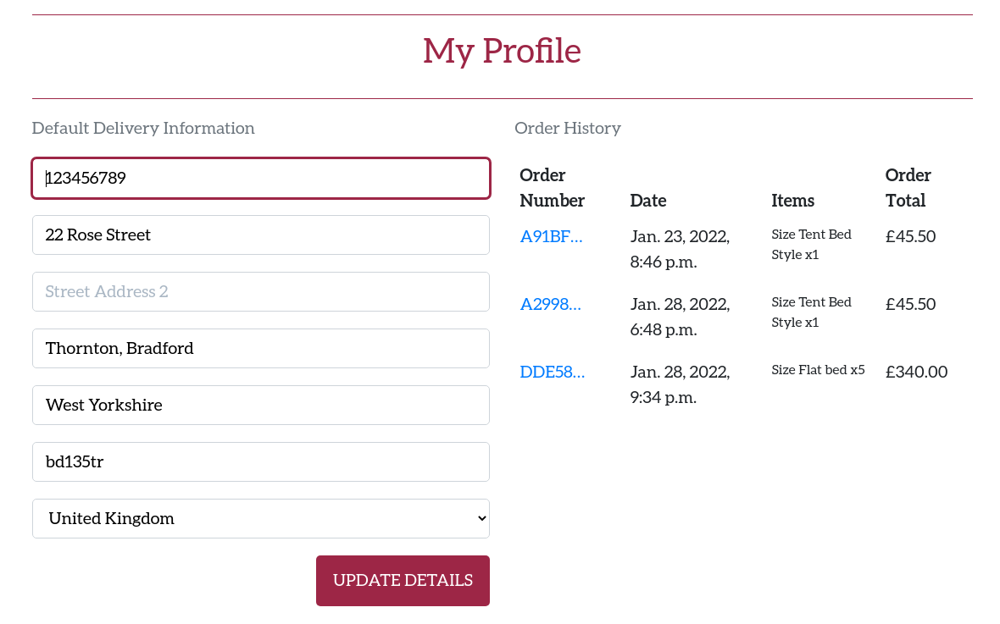

Back to [README](README.md)  

[**Index**](#up)  
[**1. User stories**](#1-user-stories)  
[**2. Manual testing**](#2-manual-testing)   
[**3. Automated testing**](#3-automated-testing)   
[**4. Responsiveness**](#4-responsiveness) 

# 1. User stories  

As a ***Website visitor***  I want to be able to:

- **Understand what it's got to offer**: The home page displays a dog picture with the message "Quality dog accesories" and a call to action button to enter the shop.
- **Find a list of products**: upon clicking the Shop Now button the user can find all the products displayed.
- **Filter the list of products**: the products page offers several filtering options( by price, rating, name and category).
- **Search the list of products**: user can make use of the search bar displayed to look for a specific product.
- **See details about a product**: each product displays a description along other important elements (name, category, sizes, price and rating) .
- **See the total of my shopping bag**: when adding products to the shopping bag the total displays/updates accordingly.
- **Purchase products without being registered**: visitors are not required to register before making a purchase.
- **Receive email confirming my order details**: Upon successful checkout, an email is send to confirm the order.
- **Browse the blog for relevant information**: The blog contains relevant information about how to chose the right sizes for example.
- **Easily Register for an account**: the account icon is displayed on mobile and is available on all pages and the sign up process only requires an email address, a username and password.

****

As a ***registered user***  I want to be able to:  
- **Easily Log In/Out**: log in can be done with email address or username and upon clicking the log out button a confirmation message double checks the action.
- **Easily recover forgotten password**: on the Sign In page a *Forgot Password* link offers the option of recovering the password.
- **Save my default delivery details**: upon checkout, the user can tick a box to confirm they want their info to be saved. Additionally, the info can be updated on the profile page.
- **View my purchase history**: if the user is logged in they can find details about their past orders on the Profile page.
****
As a ***business owner*** I want to be able to:  
- **View, add, update and delete products**: Admin has access to all the products and can perform all CRUD operations.
- **Write blog posts about products**: Admin can write and update blog posts as well as approve/delete comments on blog posts.

# 2. Manual testing
**Navigation**
| Test                                    | Action                                        | Result                                                               | Bugs |
|-----------------------------------------|-----------------------------------------------|----------------------------------------------------------------------|------|
| Nav links change colour on hover        | Hover over elements                           | Nav links change colour to Ruby                                      |      |
| Website logo sends user to home page    | Click on logo                                 | Redirects user to home page                                          |      |
| Dropdown menu works                     | Click on dropdown and see relevant categories | User redirected to categories                                        |      |
| Click on category tag displays products | Click on tag                                  | Products from the same category are displayed                        |      |
| Search bar returns query                | Input query                                   | The query is returned with the number of products found or 0 if none |      |
| My account(logged-out)                  | Click on My Account                           | Unregistered users can only see Register and Login as options        |      |
| My account(logged-in)                   | Click on My Account                           | Logged in user can see My Profile and Logout links                   |      |
| My account(logged-in as superuser)      | Click on My Account                           | Superuser can see Product Management, My Profile and Logout links    |      |
| Bag                                     | Click on bag                                  | Sends user to Shopping bag page                                      |      |

**Footer**
| Test                       | Action                               | Result                      | Bugs |
|----------------------------|--------------------------------------|-----------------------------|------|
| Footer stays to the bottom | Check footer on each individual page | Footer sticks to the bottom |      |
| Check social links open    | Click each icon                      | Icons open in a new tab     |      |

**Home Page**
| Test                              | Action                                 | Result                               | Bugs |
|-----------------------------------|----------------------------------------|--------------------------------------|------|
| Hero image displays well          | Check on Google Chrome developer tools | Image is showing well on all devices |      |
| Text is visible and clears footer | Resize window                          | Text is visible                      |      |
| Check shop now button works       | Click on button                        | Takes user to Products page          |      |
|                                   |                                        |                                      |      |

**Products Page**
| Test                      | Action                            | Result                                      | Bugs |
|---------------------------|-----------------------------------|---------------------------------------------|------|
| Products are displayed    | Go on products page               | Total numbers of products shown             |      |
| Image is displayed        | Scroll down to check all products | Image is visible or the default image shows |      |
| Check sort selector works | Select each individual option     | Products are displayed accordingly          |      |

**Product detail Page**
| Test                                                    | Action                                                      | Result                                                                                    | Bugs |
|---------------------------------------------------------|-------------------------------------------------------------|-------------------------------------------------------------------------------------------|------|
| Relevant fields are displayed                           | Click on a product                                          | Fields are in place displaying relevant information                                       |      |
| Size selector changes according to the product category | Click on products from Beds, Collars and Harness Categories | For Beds sizes are S-XL and for the other two S-L                                         |      |
| Quantity input field                                    | Check the value can't be outside the 1-99 range             | Form control works, user is asked to input a value greater than 0 and less or equal to 99 |      |
| Shop More button                                        | Click                                                       | Takes user to Products page                                                               |      |
| Add to Bag button                                       | Click                                                       | Adds selected product/size in the bag                                                     |      |
| Bag updates total                                       | Add to bag                                                  | Total updates and toast message shows Success                                             |      |

**Shopping Bag Page**
| Test                   | Action                                        | Result                                     | Bugs                                |
|------------------------|-----------------------------------------------|--------------------------------------------|-------------------------------------|
| Products are displayed | Click on Bag icon                             | Products are displayed on individual lines |                                     |
| Same product with different sizes is displayed individually | Check line item                              | Products with different sizes are displayed on individual lines |                                     |
| Update quantity        | Click on arrows to increase/decrease quantity | Only the last added item can be updated    | Can't update quantity for all items* |
| Delete line item       | Click red bin icon                            | Item is removed from the shopping bag      |                                     |
| Keep shopping button   | Click                                         | Takes user to Products page                |                                     |
| Secure checkout button | Click                                         | Takes user to Checkout page                |                                     |

* Bug was fixed by adding the `closest()` method to make sure the right form was updated if more than one form existed in the shopping bag.

**Checkout Page**
| Test                                                            | Action                         | Result                                                  | Bugs |
|-----------------------------------------------------------------|--------------------------------|---------------------------------------------------------|------|
| Order summary displays the same amount of items as shopping bag | Compare Bag with Checkout page | Same products displayed                                 |      |
| Form is prefilled                                               | Check form                     | If user is logged in, form is prefilled with saved info |      |
| Confirm Stripe webhook proccessed order                         | Check Stripe Webhooks          | Order is processed                                      |      |

**Profile Page**
| Test                             | Action                           | Result                            | Bugs |
|----------------------------------|----------------------------------|-----------------------------------|------|
| Update details                   | Change any field                 | Account details are updated       |      |
| Check order history is displayed | Login and go to My Profile page  | Order history is displayed        |      |
| View past orders                 | Click on Order number            | Detailed order is being displayed |      |  

**Add/Edit Product**
| Test                                     | Action                    | Result                                                         | Bugs |
|------------------------------------------|---------------------------|----------------------------------------------------------------|------|
| Access Add/Edit Product                  | Manual input url          | Page redirects to Sign In if user is not authenticated         |      |
| Access Add/Edit Product                  | Sign in as any user       | User is redirected to Home page and Error message is displayed |      |
| Check new/updated product is in database | Check product detail page | Product details can be seen                                    |      |

**Delete a Product**
| Test                                   | Action      | Result                                         | Bugs |
|----------------------------------------|-------------|------------------------------------------------|------|
| Delete a product                       | Click       | Delete modal pops-up and asks for confirmation |      |
| Check product is removed from database | Go to admin | Product is removed                             |      |

**Add/Edit Blog post**
| Test                              | Action                 | Result                                                         | Bugs                                                            |
|-----------------------------------|------------------------|----------------------------------------------------------------|-----------------------------------------------------------------|
| Access Add/Edit Post              | Manual input url       | Page redirects to Sign In if user is not authenticated         |                                                                 |
| Access Add/Edit Post              | Sign in as any user    | User is redirected to Home page and Error message is displayed |                                                                 |
| Check new post is in database     | Check post detail page |                                                                | Error when trying to add a blog post using Blog Management link* |
| Check updated post is in database | Check post detail page | Blog post details can be seen                                  |                                                                 |

* Bug was fixed by moving the add_post url before the post_detail url, as django was finding this url and trying to assign the slug hence the error.  

**Delete Blog post**
| Test                                | Action                  | Result                                         | Bugs |
|-------------------------------------|-------------------------|------------------------------------------------|------|
| Delete a post                       | Click                   | Delete modal pops-up and asks for confirmation |      |
| Check post is removed from database | Go to admin             | Post is removed                                |      |
| Users can access delete url         | Sign in as regular user | User redirected to home page                   |      |

# 3. Automated testing  

Performance is generally better on desktop view, on mobile view the low performance is related to image size. Due to time restraints this issue has not been addressed. Detailed reports can be found [here](wireframes/lighthouse).

**HTML validator**
- [W3C - HTML](https://validator.w3.org/): no errors
- [W3C - CSS](https://jigsaw.w3.org/css-validator/): no errors
- [JS Hint](https://jigsaw.w3.org/css-validator/): no errors
- [Pep8 compliance](http://pep8online.com/): passed all `.py` files, all errors fixed apart from one error in `views.py` and one in `webhookhandler.py` within checkout app. Lines could not be shortened without making the code illegible.

# 4. Responsiveness  

The website has been tested on Chrome, Safari and Amazon Silk browser.  
Also, using Google Chrome developer tools, the site was tested on the following devices:  

- iPhone SE
- iPhone XR
- iPhone 12 PRO
- Pixel 5
- Samsung Galaxy S8
- Samsung Galaxy S6
- iPad Air
- iPad Mini
- Surface Pro 7
- Surface Duo
- Samsung Galaxy A51/71
- Nest Hub
- Nest Hub Max

Real world testing has been done on:
- iPhone 6
- Samsung Galaxy S6
- Samsung Galaxy A5
- Amazon Fire 10
- HP i5 laptop